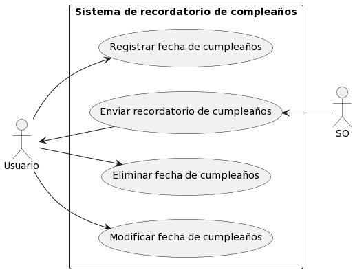
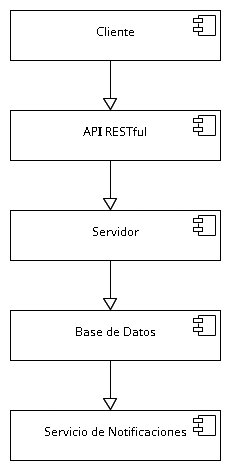

# i152-is-2023

## Proyecto para Ingeniería de Software del Instituto Nº 152

El grupo se dividió en 7 [roles](documentos/roles.txt) donde existen:
1. Product Owner (1)
2. Tech Lead (1)
3. Diseñador/a UX/UI (1)
4. Desarrollador (2)
5. Tester (1)
6. Project Manager (1)
7. Analista (1)

El proyecto consiste en un sistema de recordatorio de cumpleaños

El diagrama de casos de uso es el que se detalla a continuación:

El diagrama de componentes es el que se detalla a continuacion:

